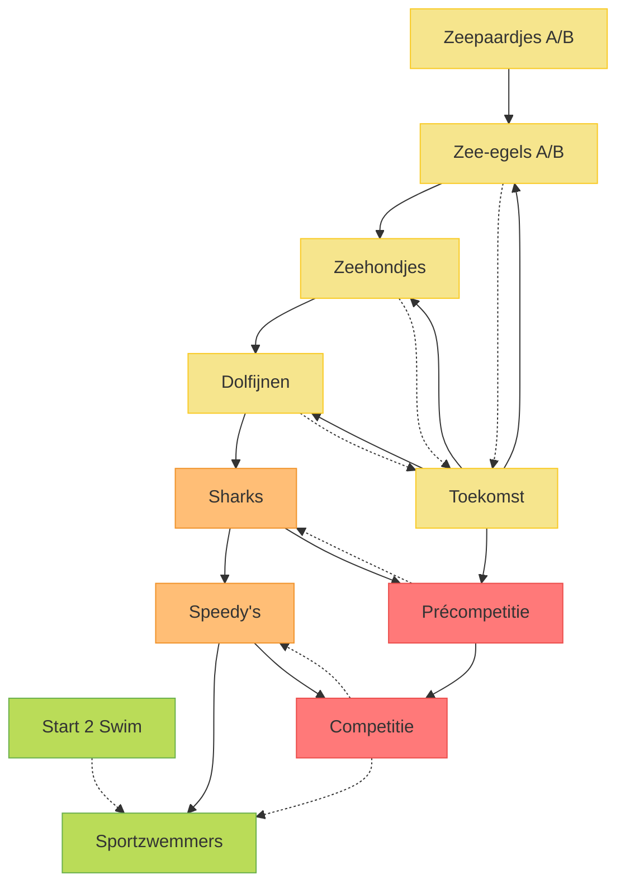

# Organigram

In het onderstaande organigram zijn stippelijnen eerder uitzonderlijke overgangen tussen groepen, de volle lijnen zijn de gewoonlijke overgangen.

Elke afdeling heeft ook zijn eigen kleur:

- Zwemschool
- Jeugd
- Competitie
- Volwassenen

